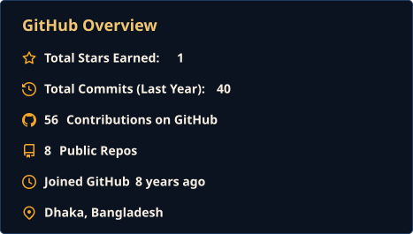
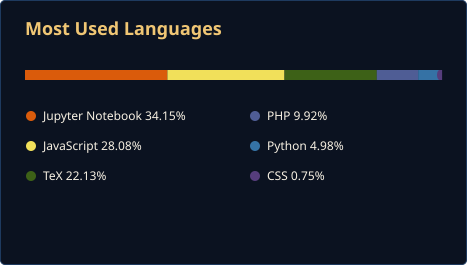

<!-- Header Banner -->

<!-- Typing Animation -->

 

<!-- Status Badge -->

  

<!-- Quick Links -->

 

<!--  -->

---

## About Me

Final-year CSE student at **BRAC University** with a strong foundation in software development and system design. I build full-lifecycle projects across web, ML, graphics, and networking — managing codebases with Git/GitHub and working comfortably in Linux environments. Currently seeking a software engineering internship to contribute to impactful products while gaining industry experience.

---

## Tech Stack

### Languages

  

### Frontend & Backend

  

### AI/ML & Data

  

### Databases & DevOps

  

---

## Featured Projects

  

---

## GitHub Analytics

  
  

<picture>
  <source media="(prefers-color-scheme: dark)" srcset="https://raw.githubusercontent.com/MuntasirMamunSakib/MuntasirMamunSakib/output/pacman-contribution-graph-dark.svg">
  <source media="(prefers-color-scheme: light)" srcset="https://raw.githubusercontent.com/MuntasirMamunSakib/MuntasirMamunSakib/output/pacman-contribution-graph.svg">
  
</picture>

---

**Open to Software Engineering internships — Full-Stack, Backend, or ML-adjacent roles.**

 

 

